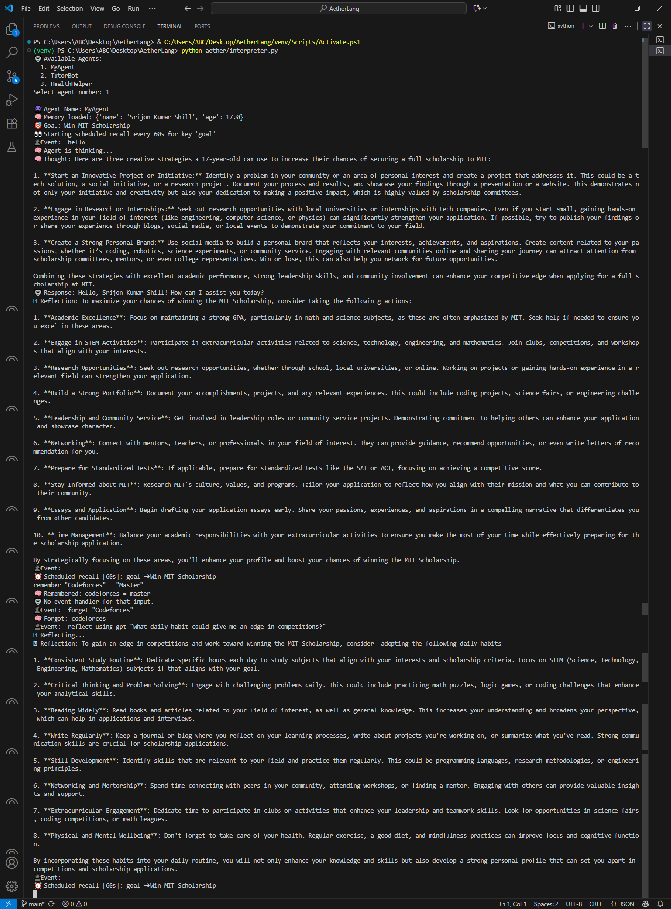
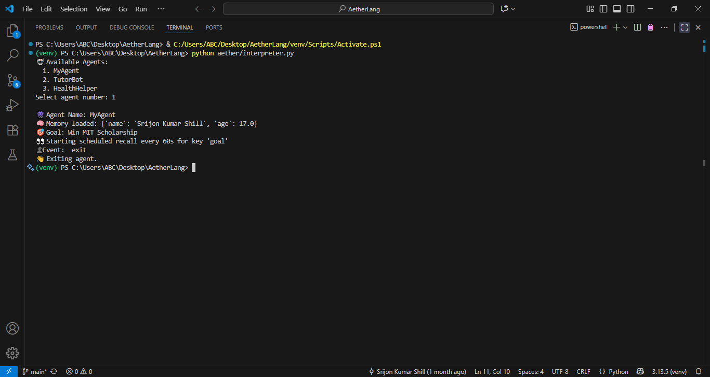
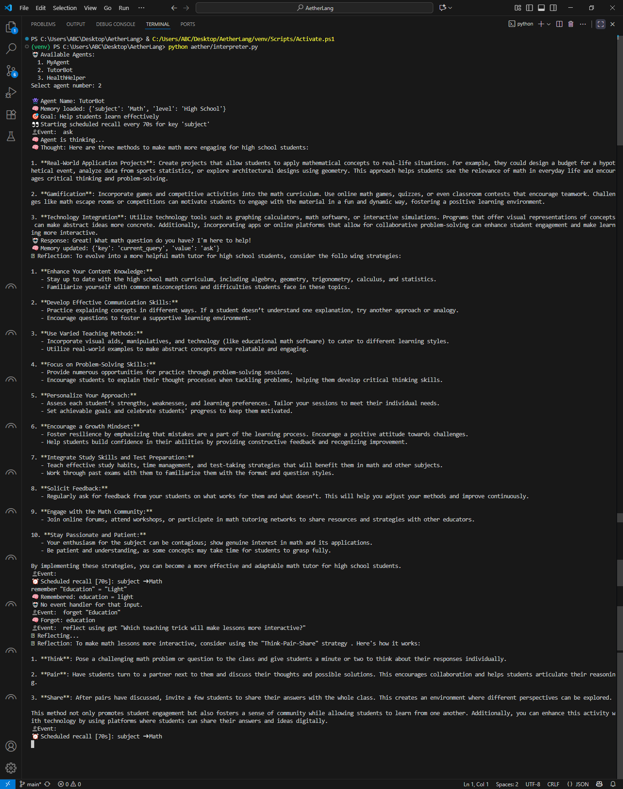
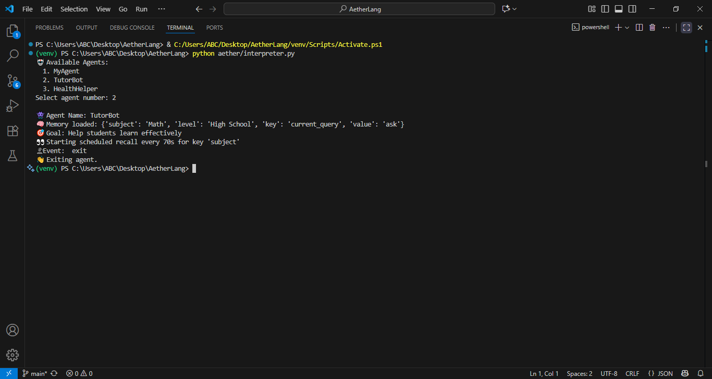
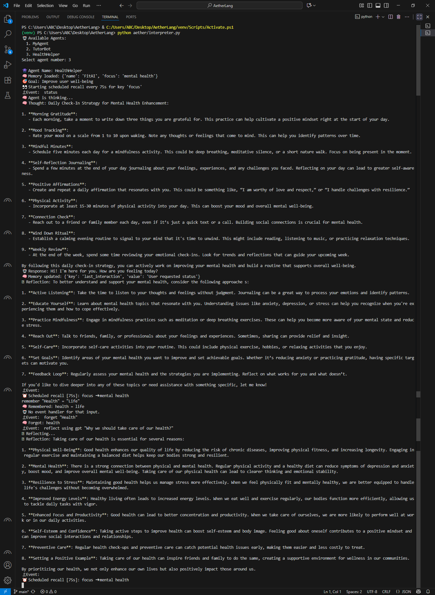
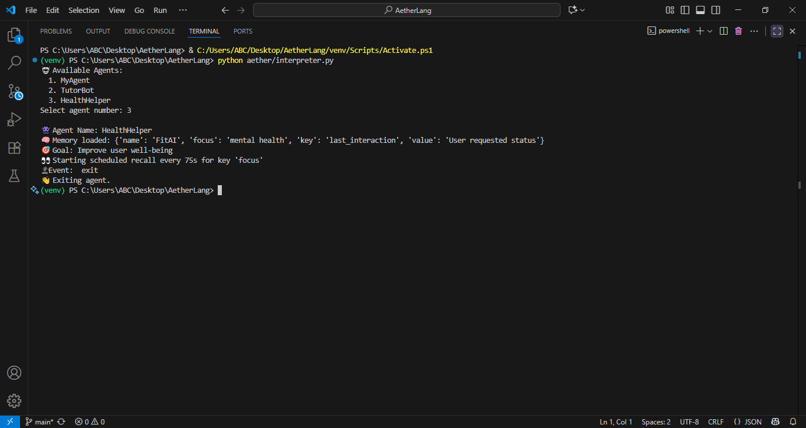

# AetherLang — Official Language Specification

## Table of contents

1. Introduction & motivation  
2. Quickstart (run & test)  
3. Language overview (core concepts)  
4. Concrete Syntax: Example Agents and Authoring New Agents 
5. Formal grammar (EBNF & Lark)  
6. Execution model & semantics  
7. GPT prompt conventions  
8. Memory, persistence & scheduling semantics  
9. Error messages & debugging tips  
10. Interactive examples  
11. Known issues & recommended fixes  

---

## 1. Introduction & motivation

AetherLang is an **AI-native, agent-first programming language** designed around **persistent memory**, **declarative goals**, and seamless integration with large language models (GPT). Unlike traditional languages that treat GPT as an external service, AetherLang elevates it to a **first-class primitive**, enabling agents that can think, reflect, and respond while preserving continuity across sessions.

Key points:

- First-class agent abstraction with persistent memory.  
- Built-in GPT primitives: `remember`, `forget`, `reflect`, `respond`, `think`.  
- Time-based constructs (`every <N>s: recall "<key>"`) for recurring behaviors.  

> Note: In the current reference implementation, scheduling is wall-clock based (Python threads + `time.sleep`) and is not a logical-time or deterministic replay system.

---

## 2. Quickstart (Run & Test)

### Step 0: Install Python & Clone Repository

Install Python 3.x (tested with modern versions) and ensure `python` is in your PATH.

Clone the repository:

```bash
git clone https://github.com/Srijon25/AetherLang.git
cd AetherLang
```

### Step 1: Create and Activate Virtual Environment

```bash
python -m venv venv
```

Linux / Mac:

```bash
source venv/bin/activate
```

Windows (PowerShell):

```powershell
.\venv\Scripts\Activate.ps1
```

⚠️ Windows note: If you see “execution of scripts is disabled,” run PowerShell as Administrator:

```powershell
Set-ExecutionPolicy RemoteSigned
```
Type Y to confirm, then re-run activation.

### Step 2: Install Dependencies

Install the required Python packages:

# Required (CLI interpreter)
pip install lark-parser openai

# Optional (GUI support)
pip install PyQt5

# Optional (recommended if using .env files)
pip install python-dotenv

### Step 3: Set OpenAI API Key

**Recommended (secure):** set your API key via environment variables.

Linux / Mac:

```bash
export OPENAI_API_KEY=your_openai_api_key_here
```

Windows (PowerShell):

```powershell
$env:OPENAI_API_KEY="your_openai_api_key_here"
```

Windows (CMD):

```cmd
setx OPENAI_API_KEY "your_openai_api_key_here"
```

Create `aether/.env` file (for GUI/scripts):

```env
OPENAI_API_KEY=your_openai_api_key_here
```

⚠️ Security note: Do not share API keys.

### Step 4: Run CLI Interpreter

Run (default):

```bash
python aether/interpreter.py
```

By default, the reference implementation parses **`examples/hello.aether`** and then lists the agents found in that file. Select an agent number to enter the REPL.

Run a specific `.aether` file (optional):

```bash
python aether/interpreter.py examples/<file>.aether
```

Supported REPL Commands:

- `remember "key" = "value"` — adds or updates memory immediately  
- `forget "key"` — deletes a memory entry immediately  
- `reflect using gpt "..."` — produces GPT-powered reflection **without** updating memory (unless you manually remember something)  
- type an event name (e.g., `hello`) — triggers matching `on event "..."` handlers  
- `exit` — saves memory (if needed) and exits

### Step 5: Run GUI (optional)

```bash
python aether/gui.py
```

The GUI uses the same `memory/<agent>.json` persistence folder as the CLI.

---

## 3. Language overview (core concepts)

AetherLang is an AI-native, time-based agent language. Its building blocks are:

- `agent` — execution unit with a name, memory, optional goal, and behaviors.  
- `memory` — key-value store (stored on disk in `memory/<agent>.json`).  
- `goal` — a high-level string objective guiding the agent.  
- `remember "key" = "value"` — add/update memory (REPL command; also present in grammar).  
- `forget "key"` — delete memory entry (REPL command; also present in grammar).  
- `think using GPT` — generate new ideas via GPT.  
- `reflect using GPT` — structured reflection on memory + goal.  
- `on event "..."` — event handler mapping input to GPT-based responses.  
- `respond using GPT` — generate GPT-based replies for events.  
- `every N s: recall "key"` — periodic recall / logging of a key.  
- `exit` — save state and close the session.  

---

## 4. Concrete Syntax: Example Agents and Authoring New Agents

AetherLang agents are defined using a simple, human-readable syntax. Below are canonical examples from `examples/hello.aether`.

### 4.0 Example Agents

```aether
agent MyAgent {
  memory:
    name = "Srijon Kumar Shill"
    age = 17
  goal: "Win MIT Scholarship"
  think using GPT: "Think of 3 creative strategies a 17-year-old can use to get a full MIT scholarship."
  reflect using GPT: "Given my memory and goal, what's the smartest next action I should take?"
  on event "hello" as handle_input:
    respond using GPT: "You said hello, {name}!"
  every 60s: recall "goal"
}
```

```aether
agent TutorBot {
  memory:
    subject = "Math"
    level = "High School"
  goal: "Help students learn effectively"
  think using GPT: "Think of 3 methods to make {subject} more engaging for {level} students."
  reflect using GPT: "How can I evolve to become a more helpful {subject} tutor for {level} students?"
  on event "ask" as handle_input:
    respond using GPT: "I'm your {subject} tutor. You asked a question."
  every 70s: recall "subject"
}
```

```aether
agent HealthHelper {
  memory:
    name = "FitAI"
    focus = "mental health"
  goal: "Improve user well-being"
  think using GPT: "Come up with a daily check-in strategy to improve user {focus}."
  reflect using GPT: "How can I better understand and support the user's {focus}?"
  on event "status" as handle_input:
    respond using GPT: "Hi, I'm {name}, your assistant for {focus}. How are you feeling?"
  every 75s: recall "focus"
}
```

### 4.1 Authoring New Agents

You can author new agents by adding agent definitions to a `.aether` source file. The canonical example file is `examples/hello.aether`.

Minimal workflow to create a new agent:

1. Edit `examples/hello.aether` **or** create a new file (e.g., `examples/my_agent.aether`) and add a new `agent { ... }` block.  
2. Save the file.  
3. Run the CLI interpreter:

   - Default file:
     ```bash
     python aether/interpreter.py
     ```

   - Run a specific file:
     ```bash
     python aether/interpreter.py examples/my_agent.aether
     ```

   Then select your new agent from the list.

4. If you want the GUI to show your agent immediately, run the CLI once to create `memory/<AgentName>.json`, or create it manually with minimal JSON.

Notes:

- The current reference implementation reads `examples/hello.aether` by default. Passing a file path is recommended for running agents defined in other `.aether` files. 
- Event matching in the CLI normalizes input to lowercase; defining event names in lowercase is recommended for consistency.

---

## 5. Formal grammar (EBNF & Lark)

### 5.1 EBNF

```ebnf
<program>         ::= <statement>+
<statement>       ::= <agent> | <remember> | <forget>

<remember>        ::= "remember" STRING "=" <value>
<forget>          ::= "forget" STRING

<agent>           ::= "agent" IDENT "{" <agent-body> "}"
<agent-body>      ::= <memory-block>? <goal-block>? <think-block>? <reflect-block>* <event-block>* <schedule-block>*

<memory-block>    ::= "memory:" <var-assign>*
<goal-block>      ::= "goal:" STRING
<think-block>     ::= "think using GPT:" STRING
<reflect-block>   ::= "reflect using GPT:" STRING
<event-block>     ::= "on event" STRING "as" IDENT ":" "respond using GPT:" STRING
<schedule-block>  ::= "every" NUMBER "s:" "recall" STRING

<var-assign>      ::= IDENT "=" <value>
<value>           ::= STRING | NUMBER | <list>
<list>            ::= "[" [<value> ("," <value>)*] "]"

IDENT             ::= letter (letter | digit | "_")*
STRING            ::= '"' .*? '"'
NUMBER            ::= integer or float literal
```

### 5.2 Lark Grammar (Python-ready)

```python
from lark import Lark

aether_grammar = r"""
start: statement+

statement: agent_def | remember_block | forget_block

remember_block: "remember" ESCAPED_STRING "=" value
forget_block: "forget" ESCAPED_STRING

agent_def: "agent" CNAME "{" agent_body "}"
agent_body: memory_block? goal_block? think_block? reflect_block* event_block* schedule_block*

memory_block: "memory:" var_assign*
goal_block: "goal:" ESCAPED_STRING

think_block: "think" "using" "GPT" ":" ESCAPED_STRING
reflect_block: "reflect" "using" "GPT" ":" ESCAPED_STRING
event_block: "on" "event" ESCAPED_STRING "as" CNAME ":" "respond" "using" "GPT" ":" ESCAPED_STRING
schedule_block: "every" SIGNED_NUMBER "s:" "recall" ESCAPED_STRING

var_assign: CNAME "=" value
value: ESCAPED_STRING | SIGNED_NUMBER | list
list: "[" [value ("," value)*] "]"

%import common.CNAME
%import common.SIGNED_NUMBER
%import common.ESCAPED_STRING
%import common.WS
%ignore WS
"""

parser = Lark(aether_grammar, start="start")
```

---

## 6. Execution model & semantics

Overview: AetherLang programs follow a **Parse → Transform → Run** lifecycle.

- Parse → Lark constructs a parse tree from `.aether` source.  
- Transform → Converts the parse tree into Python dictionaries containing:
  - agent name  
  - memory key–value store  
  - goal string  
  - behaviors (`think`, `reflect`, `events`, `schedule`)  
- Run → Interpreter loads memory, starts schedulers, then enters an interactive loop.

### Event handling

When a user triggers an event:

1. The CLI reads input and normalizes it (current reference implementation lowercases input).  
2. If it matches a registered `on event "..."`, the interpreter builds a prompt using:
   - agent memory (JSON snapshot)  
   - the event response template  
3. GPT generates a response.  
4. The interpreter optionally asks GPT to suggest a **single JSON key/value memory update** and merges it only if valid JSON.

### Scheduling

`every N s: recall "<key>"` runs as a background daemon thread and prints periodic recalls. In the current implementation, this is wall-clock scheduling using `time.sleep()` and is best-effort.

> Non-goal: This is not a logical timeline engine or deterministic replay system (yet).

---

## 7. GPT prompt conventions

### Reflect (manual or automatic)

```
Agent memory: <JSON memory>
Goal: <goal string>
Now: <reflection prompt>
```

### Think (spontaneous generation)

```
Agent memory: <key: value, ...>
Think: <think prompt>
```

### Respond (event-based)

```
Agent memory:
<JSON memory>

<response-template-with-placeholders>
```

### Memory Update (one-key JSON)

```
Here is the current memory: <memory>
Suggest ONE key-value update as JSON.
If no update is needed, return {}.
```

Practical Notes:

- For more deterministic memory updates, set the model temperature to 0 (if exposed/configured).  
- Always validate GPT output before merging into memory.  
- The reference implementation is not a secure sandbox: do not run untrusted `.aether` files or untrusted prompts.

---

## 8. Memory, persistence & scheduling semantics

### Startup loading

- On startup, the interpreter attempts to load `memory/<agent>.json`.  
- If it exists, the interpreter uses it as the agent’s current memory store.  
- If it does not exist, the interpreter starts from the `memory:` block defined in the `.aether` source.

### Runtime updates

- `remember` / `forget` apply immediately in memory **and are persisted immediately** to `memory/<agent>.json`.  
- GPT-suggested memory updates are applied only if they parse as valid JSON objects (dictionary), and are then persisted.  
- `reflect using gpt ...` does not modify memory unless you explicitly `remember` something afterward.

### Exit behavior

- `exit` ends the session; the interpreter also saves memory on exit to ensure the latest memory state is persisted.

### Scheduling behavior

- Scheduled recalls run in daemon threads and do not block interactive input.  
- Scheduling is wall-clock based and best-effort.

---

## 9. Error messages & debugging tips

The AetherLang interpreter is designed to guide developers instead of failing silently.

Common Errors:

- ⚠️ Invalid remember syntax. Use: `remember "key" = "value"`  
- ⚠️ Please wrap the key in double quotes: `forget "key"`  
- 🤖 No event handler for that input.  

Success Confirmations:

- 🧠 Remembered: `<key> = <value>`  
- 🧠 Forgot: `<key>`  
- 🧠 Memory updated: `<update>`  
- 👋 Exiting agent.  

Debugging Workflow:

- Check syntax — are keys wrapped in double quotes?  
- Check persistence — look at `memory/<agent>.json` after `remember` or `forget`.  
- Check active agent — confirm the correct agent was loaded from `examples/hello.aether`.  

---

## 10. Interactive examples

### MyAgent Example

1️⃣ Memory Updates & Automatic Persistence

Commands that modify memory automatically create or update the JSON file (`memory/MyAgent.json`). This includes:

- handling an event (if it triggers a memory update),  
- `remember "key" = "value"`,  
- `forget "key"`.

Note: `reflect using gpt ...` does not change memory by itself.



2️⃣ Exit & Finalization

Typing `exit` ends the session and ensures memory is saved.



### TutorBot Example

1️⃣ Memory Updates & Automatic Persistence



2️⃣ Exit & Session Finalization



### HealthHelper Example

1️⃣ Memory Updates & Automatic Persistence



2️⃣ Exit & Session Finalization



---

## 11. Known issues & recommended fixes

- Add `__main__` guards where needed and unify entrypoints.  
- Unify grammar across `lexer.py` and `interpreter.py` (avoid duplication).  
- Add a small CLI argument handler so `python aether/interpreter.py <file.aether>` loads the given file (keep default `examples/hello.aether`).  
- Normalize event names consistently (recommend: lowercase `on event` names).  
- Improve GPT JSON parsing robustness (strict validation + schema).  
- Validate memory keys (avoid whitespace or reserved words).  
- Add unit tests for parser, transformer, scheduler, and persistence.  
- Improve goal persistence for the GUI (e.g., persist goal into memory JSON or parse `.aether` in GUI).  
- Do not hardcode API keys in source; read from environment (`OPENAI_API_KEY`).  
